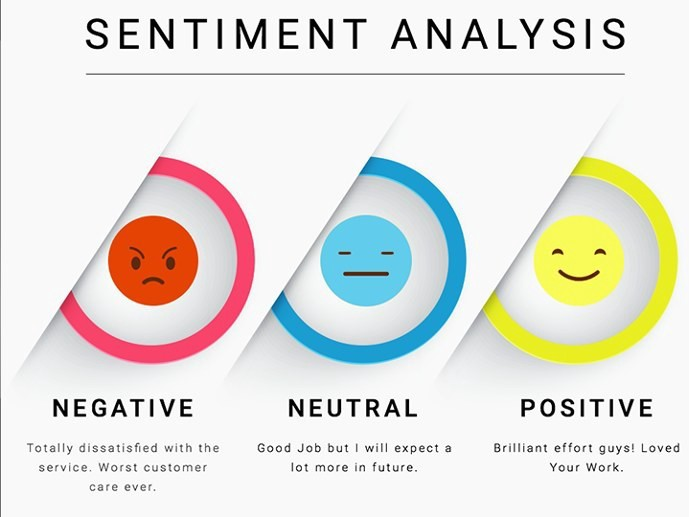

# Optimization of Algorithm

To optimize the algorithm and have the best time series forecasting, several factors of
the stock price data have to be taken into consideration. 

From the exploratory analysis, we are able to narrow down the 
number of concept used and time series analysis models.  

# Optimization upon ARIMA

To provide a more accurate prediction of ARIMA, it will require an additional model to overcome
the lack in measuring change in variance.

## Generalized AutoRegressive Conditional Heteroskedasticity (GARCH)

GARCH, a model used in analyzing time-series data, measuring volatility of the graph based on an 
autoregressive moving average process.

As the residual of ARIMA have **no constant in variance of error terms** (heteroskedastic) , GARCH can be 
utilized to model after the residual, measuring the volatility of the stock movement, predicting the 
range of price movement.

As seen below, the comparison of the model with the actual values, the model have an accurate prediction for
the volatility of the graph.

As the calculation for the parameters of ARIMA-GARCH is more complex, there is a higher risk of errors during the
calculation. Even with tools such as **auto-ARIMA**, it will focus more upon one of its metrics, leading to the best fitted model,
but a loss in parsimony by the additional AR and MA lags, thus causing the over-fitting of the model.

In addition, the prediction of ARIMA-GARCH has moderate accuracy, the forecasted values differ greatly from the
actual value. Therefore, further search for a more accurate prediction is required.

---
# Use of Neural Network

Neural Network, loosely modeled after the brain, designed to recognize patterns and
interpreting data using machine perception, clustering or labeling raw input.

## Recurring Neural Network (RNN)

A type of artificial neural network used on sequential data, utilizing train data to learn.
Through the use of "memory", they can take information from prior inputs to influence the current
inputs and output.

Through leveraging on backpropagation through time, it is able to determine the gradient by calculating
errors from its output layers to its input layers. By summing up the errors at each time steps, it allows
the adjustment of the parameters of the model appropriately.

### Issue with RNN

However, with the leverage on backpropagation through time, the size of gradient can be either exponential or
too small, causing the algorithm to stop learning and creating an unstable model.

## Long Short-Term Memory (LSTM)

LSTM are an extension of RNNs with its ability to eliminate the exploding gradient and vanishing gradient without
the alteration of training model. 

Since LSTM is an extension of RNN, it is capable to handle time-series data, assigning correct weight on the
observation, handling any noise from the data.

Therefore, LSTM was chosen as an algorithm to forecast the stock price movement.

### Concept of LSTM

LSTM, a chain-like structure with four layers of neural network, each with different functionalities
* Cell state: Information are being stored
* Forget layer: Information will be completed gotten rid of
* Tanh Layer: Checking whether the information should be filtered or stored in cell state  
* Input layer: New information to be updated to the state
* Output layer: The stored information in cell will be filtered and output

### Variate of LSTM

By stacking LSTM, it is able to make the model deeper, recombining the learned representation from 
prior layers and create new representation at high levels of abstraction. Hence, it allows further optimization of the 
Neural Network.

### Utilization of LSTM

Through the use of stacked LSTM, it is able to predict the stock price movement with a margin of error and good level of accuracy.

### Drawbacks of Stacked LSTM

However, with an increased layer of abstraction, there can be an overfitting of data, leading to an extra layer of abstraction.
This can lead to the over estimation of the price and thus an inaccurate model for the stock prediction.

---

# Limitation of ARIMA-GARCH

ARIMA-GARCH using one past data of stock price to forecast and predict the stock price movement. However, when an abnormality happens
such as the **2008 market crash** or even the **sudden increase** in **$GME** or **$AMC**, it is unable to react and
predict accordingly.

Therefore, it is very important to include various factors for the prediction of stock price.

## Use of Different Predictor

By analysing the various factors which might affect the stock price prediction, we have come to the conclusion that **News** can be a good predictor
for the stock price.

## News

The reason for using news as a predictor is due to the relationship that the news and the stock price movement can have.

An example of such is the release of company's earnings report with the stock price movement.

With the release of a company's earning report, it can influence the price of a stock, a strong earning can result
in the stock price moving up and vice versa. Hence, a conclusion have come upon that news has some correlations with the 
fluctuation of price movement.

## Conversion of Unstructured Data to Structured Data

As news are unstructured data, it is important to convert the unstructured data into structured data.

However, it requires a certain metrics to assign a fair value to the article, assessing the tone of the article.

### Sentiment Analysis

Consequently, sentiment analysis, an algorithm based upon Natural Language Processing (NLP), used to evaluate the sentiment
of an article, rating a new article based on detection of the polarity and intensity expressed.

Through the evaluation of the sentiment of the article, it is able to be categorized with ease, and thus can be used as a predictor
to a target.

## Classification

As news has been converted into a structured data, it can be used as a predictor for the stock price movement.

However, the closing price of the stock is not a good indicator of the stock price movement. Therefore, it is 
important to use a variable that can indicate the general trend over a period of time.

Thus, the use of daily returns as calculated through shifting one the value of an observation with its future value a day
ahead can be a good indicator of the trend.

### Model Fitting Accuracy

Although the news data have been converted into a structured data, the accuracy of the regression tree model have an
accuracy of 60%, even with the training data reduced to an amount similar to that of the testing data.

This shows that there are various factors which might have affected the goodness of fit for the model.

Factors such as:
1. Simple filtering of the news data: only filtering data based on keywords, but
   might have included outliers or excluded vital news that can be crucial to the movement of stock.
2. Combining of financial data with social media: The combination of financial data with the sentiment of
   social media can detect the investors' confidence.
3. Increase window of period: Daily returns as the identification of trend is not a good gauge and could be increase
from daily to weekly or monthly.

### Regression Tree

A Regression Tree with a degree of 4 can allow a good evaluation of the accuracy of model.

However, from the Regression Tree that we have fitted, it does not show a good correlation between positive returns with a
positive new. Due to several factors that might have resulted in the inability to draw a good correlation as stated in model
fitting accuracy. 