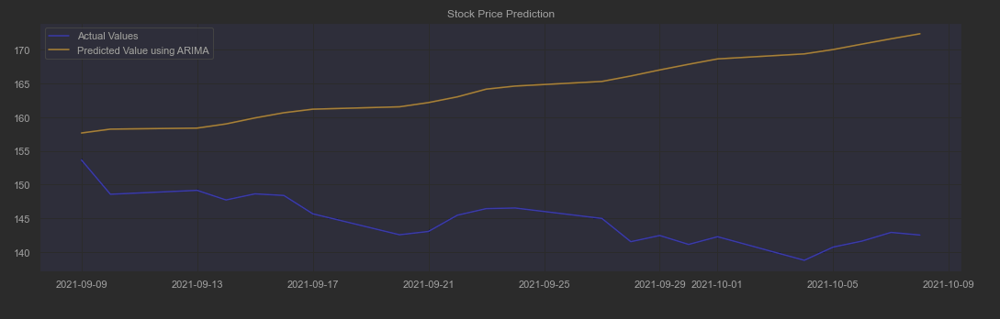

# Comparison of Models (ARIMA-GARCH VS LSTM VS Classification)

|            |                               ARIMA-GARCH                                |                               LSTM                                |
|:----------:|:------------------------------------------------------------------------:|:-----------------------------------------------------------------:|
|  Accuracy  |    5% accuracy |   40% accuracy |

# Improvement

There can be several improvement made
* An increase window for the target (Daily Returns &#8594; Weekly Returns &#8594; Monthly Returns)
* A better filtering of news data
* Combining of financial data with social media sentiment
* Use of Multi-variate LSTM model to incorporate stock price with news sentiment

# Conclusion

In this project, we have come into conclusion that generally LSTM have a better accuracy as compared to ARIMA-GARCH.

Nevertheless, a stock price movement can be dependent on many factors and that it can move in an
unpredictable manner with a drastic turn, leading to a sudden increase or a sudden drop in the price.

In addition, our approach within this project is still naive, and have not considered a more advance use of the algorithm.
One of such is the use of **multi-variate LSTM model**, able to utilize not only past stock data as a predictor but can also
consider news as another factor.

