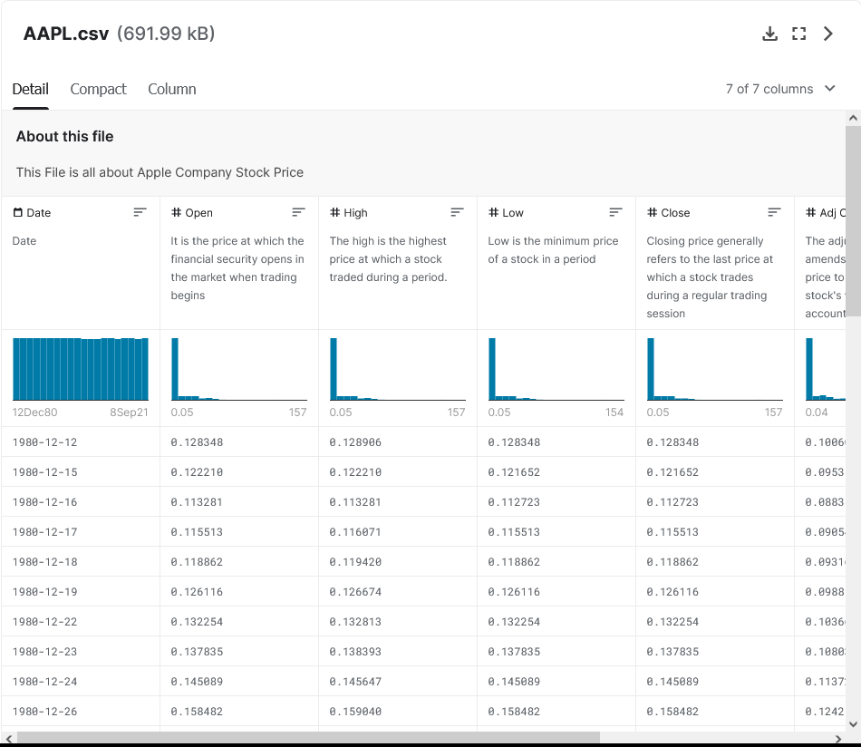

# Preparation of Data

For the preparation of data required, first we must determine the appropriate dataset that we can use our algorithm upon.

### Requirement for dataset
* Huge Dataset (At least 10 years of data)
* Appropriate sources (Open Source & Well-Trusted)
* Relevant Variables to predict (Adjusted Closing/News)
* Type of Data (Time Series)

Therefore, the dataset that we have <a href="#description">sourced</a> have met the criteria of the dataset.
<div id="top"></div>

## Extracting of Data

### News Data
The extraction of news data is:
* through HTTP Request through RapidAPI


Implementation:
```python
url = "https://google-news1.p.rapidapi.com/search"

querystring = {"q":"Apple","country":"US","lang":"en","before":"2021-10-10","after":"2021-09-08"}

headers = {
	"X-RapidAPI-Host": "google-news1.p.rapidapi.com",
	"X-RapidAPI-Key": "***************************" # key generated by X-RapidAPI
}

response = requests.request("GET", url, headers=headers, params=querystring)
x = response.text
```

The documentation for the generation of key is [here](https://docs.rapidapi.com/docs/keys).


As the data extracted from HTTP Request will be an unstructured data, under the format of JSON, 
it will be required to be converted into Excel.

Therefore, by normalizing the JSON, it can be converted into Excel easier.

The implementation for the extraction is as shown below.

```python
data = json.loads(x)
News_Test = pd.json_normalize(data["articles"])
#News_Test.head()
```
---
### Stock Price Data

The extraction of 40 years worth of stock price data is from [Kaggle](https://www.kaggle.com/datasets/meetnagadia/apple-stock-price-from-19802021/code).

<p align="right">(<a href="#top">back to top</a>)</p>

---
## Cleaning of Data

### News Data

In order to clean the data for news, we have selected few keywords 
that are being used to filter through the data.

Implementation:
```python
news_Train = news_Train[news_Train['title'].str.contains('apple|iphone|ipad', case=False, na=False,regex=True)]
news_Train = news_Train.drop(columns=['published_date'])
```

By filtering these data, we are able to have most news that are relevant to the 
products Apple is selling and drop any irrelevant news.
---

### Stock Price Data

As the earlier years of data have very little fluctuation and price change, to clean the data,
we have filtered the data to recent 10 years worth of data.

Implementation:
```python
train = train.loc[lambda x : x.index > dt.datetime(2012,12,31)]
```

<p align="right">(<a href="#top">back to top</a>)</p>

# Preparation for Algorithm

After the preparation of data, we can now consider the algorithms that can be used to model the data.

For Further Explanation, it can be continued in [Exploring Analysis](exploring_analysis.md).

---

# Appendix
## Sources & Tools Used to Extract Data
* [Kaggle](https://www.kaggle.com/datasets/meetnagadia/apple-stock-price-from-19802021/code)
* [Rapid API](https://rapidapi.com/newscatcher-api-newscatcher-api-default/api/google-news)
* [Yahoo Finance API](https://pandas-datareader.readthedocs.io/en/latest/)

### Description of Datasets
<div id="description"></div>

#### APPLTrain.csv/APPLTest.csv
|           Date           |           Open           |           High           |           Low           |          Close           |                          Adj Closing                           |            Volume            |
|:------------------------:|:------------------------:|:------------------------:|:-----------------------:|:------------------------:|:--------------------------------------------------------------:|:----------------------------:|
| Date of the stock market | Opening Price of the day | Highest Price of the day | Lowest Price of the day | Closing Price of the day | Adjusted Price for closing. (Used when there is a stock split) | Total Volume bought and sold |

#### APPLNEWS_Train.csv/APPLNEWS_Test.csv
|  Published Date  |        Date         |           Title           |           Link           |
|:----------------:|:-------------------:|:-------------------------:|:------------------------:|
| Publication Date | Date of the article | Title of the news article | URL for the news article | 

<p align="right">(<a href="#top">back to top</a>)</p>
