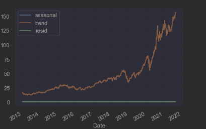
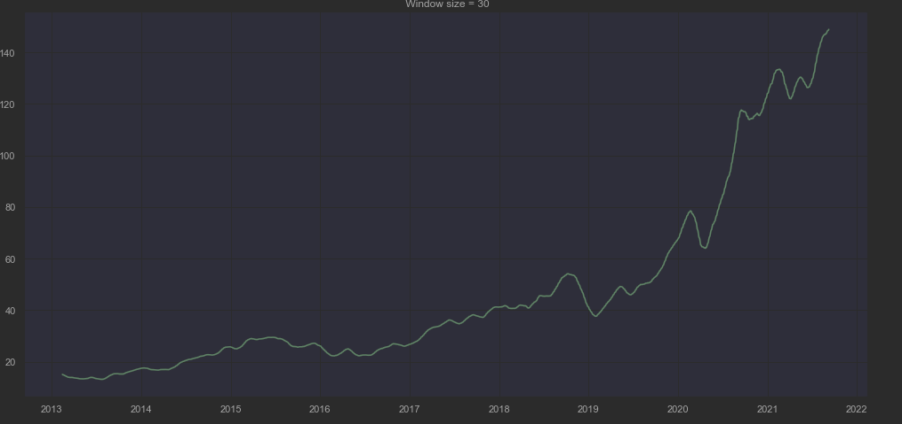
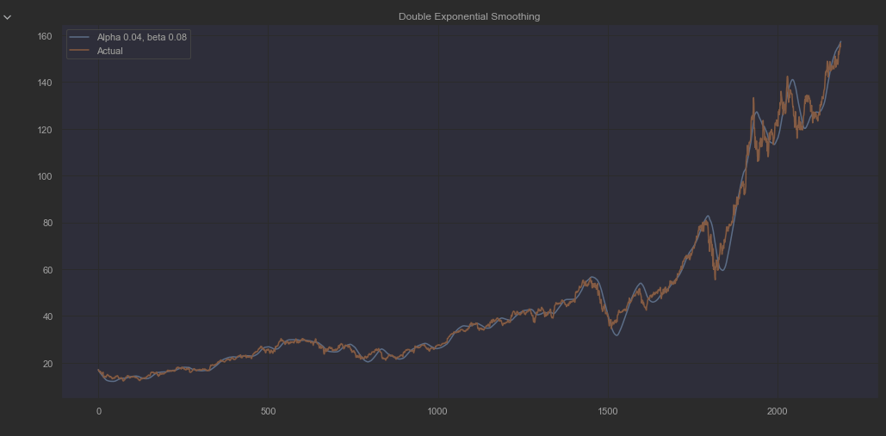
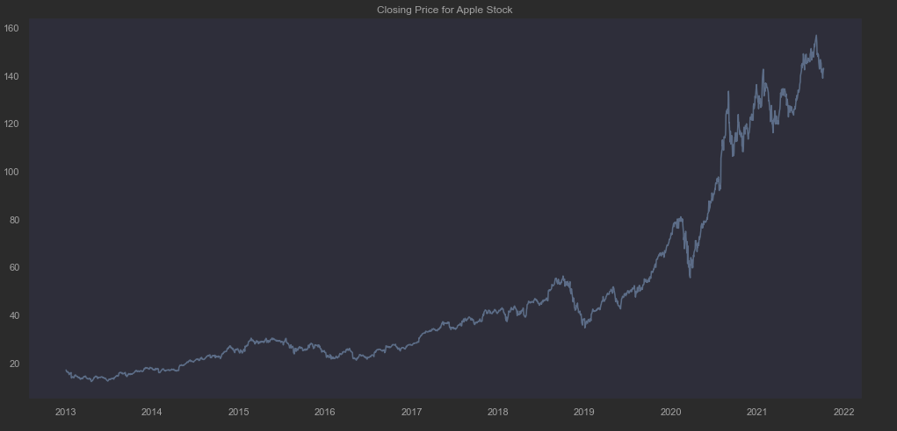
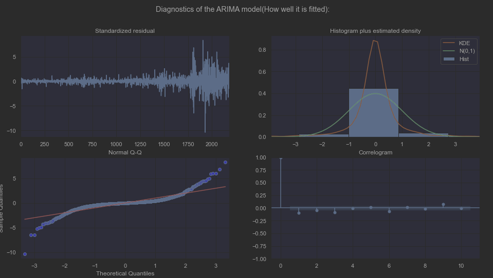
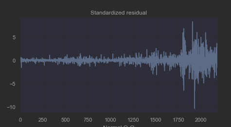

# Exploratory Analysis
## Analysis of Data Type

Before finding the right model and concept to be applied to this project, it is important to 
learn and understand the type of dataset that we have chosen to use. 

Understanding the perks and limitation the type of dataset that we use is 
invaluable as it can narrow down the concept used.

### What is Time Series

Time Series is a sequence of data points that occur in successive order over some
period of time.

It can be decomposed into three factors:

|                      |                        Explanation                         |
|:--------------------:|:----------------------------------------------------------:|
|        Trend         |                 General Movement over time                 |
|       Seasonal       |      Behavior captured in individual seasonal periods      |
|       Residual       |  Everything not captured by trend and seasonal components  | 

## Exploring Concepts

After the preparation of the data, we must first examine the relevant ML concept to manipulate 
the dataset (Time Series). Thus, there were many concepts which we can choose from:

* Classification
* Curve Fitting
* Descriptive Analysis
* Explanative Analysis
* Exploratory Analysis
* Forecast (Primary)
* Intervention Analysis

## The choices used

As our project focuses on stock market and the prediction of the movement, the primary concept that we utilized is
the forecasting concept, with the main focus upon the trend of time series.

Hence, **Moving Average** was chosen as our basis for the rest of the time series analysis model after.  

---

# General Concept of Moving Average
Using Moving Average we are able to tell the trend in which our dataset is trending towards. As it captures the average change in our data over time.
* An upwards trend shows an upswing in the price
* A downwards trend shows a decline in the price

The ability to identify the trend is important for the data as it gives a rough gauge for the future movement of the stock.

Using a simple calculation, getting the average of a **selected period** (90 days), it is able to identify the general movement
and trend of the stock.

However, due to its simplicity and the inability to take seasonality and residual into consideration,
it decreases the accuracy of the prediction. Even with a more complex calculation, a variating weight, giving
more emphasis on the more recent observation, it is still not very accurate at forecasting.

|              EMA              |                  Price Movement                   |
|:-----------------------------:|:-------------------------------------------------:|
 |  |  |

# How did we come to use ARIMA

To increase the accuracy of the time series forecasting, all the factors of time series must be taken into consideration,
putting equal emphasis on the **trend,seasonality and residual**.

Therefore, ARIMA fits the description of that model, forecasting the movement with the historical data from the
time series.

## What is ARIMA

ARIMA is a stochastic analytical model that uses time series data to forecast future trends based on
its past performance.

Categorized into three primary components:
 * AutoRegression (AR): a model that shows changing variable that regresses on its prior values
 * Integrated (I): The difference of raw observation to convert the graph into stationary
 * Moving Average (MA): The error margin from a moving average model

By finding the right parameters for ARIMA, it will create the most optimal fit of the model into our dataset. As
seen above, the diagnostics of the model shows the factors which ARIMA is based upon. 

With **quantile-quantile** (Q-Q) graph, it is able to find the trend by finding the distribution of the observations
and getting the average.

With the **auto-correlation** (ACF) graph, it is able to check for the seasonality of the graph, searching for a pattern
of fluctuation in correlation with time.

With the **standardized residual** graph, it is able to check the margin error and the range limit.

## Limitation of ARIMA

As there is obvious "clustering" phenomenon in the fluctuation, with variating fluctuation at period of times,
there is a high probability of heteroskedasticity in the error terms. However, ARIMA model is unable to model upon the
variance in time series, unable to predict accurately the volatility of the stock and not giving an accurate representation
of the range the price can fall into.

Therefore, to have a higher accuracy for the stock prediction, it is necessary to optimize ARIMA with an additional model stacked on top of itself.

For Further explanation, it will be continued in [Algorithmic Optimization](algo_opt.md).